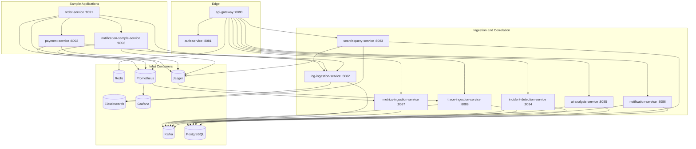

# Container Diagram

Container-level view of core services and supporting stores for the MVP.

```mermaid
flowchart TB
    subgraph edge[Edge]
        gateway[api-gateway :8080]
        auth[auth-service :8081]
    end

    subgraph data_ingestion[Ingestion and Correlation]
        logsvc[log-ingestion-service :8082]
        metsvc[metrics-ingestion-service :8087]
        tracesvc[trace-ingestion-service :8088]
        incident[incident-detection-service :8084]
        ai[ai-analysis-service :8085]
        search[search-query-service :8083]
        notify[notification-service :8086]
    end

    subgraph demo_apps[Sample Applications]
        order[order-service :8091]
        payment[payment-service :8092]
        notifSample[notification-sample-service :8093]
    end

    subgraph stores[Infra Containers]
        kafka[(Kafka)]
        postgres[(PostgreSQL)]
        elastic[(Elasticsearch)]
        redis[(Redis)]
        prom[(Prometheus)]
        graf[(Grafana)]
        jaeger[(Jaeger)]
    end

    gateway --> auth
    gateway --> search
    gateway --> incident
    gateway --> ai
    gateway --> notify
    gateway --> metsvc
    gateway --> tracesvc
    gateway --> redis

    order --> payment
    order --> notifSample
    order --> logsvc
    payment --> logsvc
    notifSample --> logsvc

    order --> prom
    payment --> prom
    notifSample --> prom
    prom --> metsvc
    prom --> graf

    order --> jaeger
    payment --> jaeger
    notifSample --> jaeger
    jaeger --> tracesvc
    tracesvc --> kafka
    tracesvc --> postgres

    logsvc --> kafka
    logsvc --> elastic
    metsvc --> kafka
    incident --> kafka
    incident --> postgres
    ai --> postgres
    ai --> kafka
    search --> elastic
    search --> postgres
    search --> jaeger
    notify --> postgres
    notify --> kafka
```
