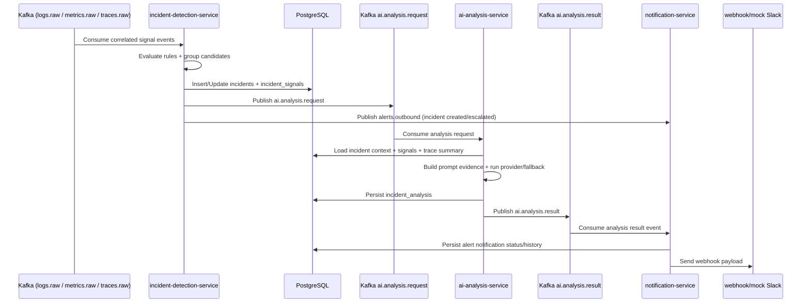

# Sequence: Incident Analysis

This sequence captures detection, AI analysis generation, and notification fan-out.

```mermaid
sequenceDiagram
    participant Kafka as Kafka (logs.raw / metrics.raw / traces.raw)
    participant Incident as incident-detection-service
    participant Pg as PostgreSQL
    participant AiReq as Kafka ai.analysis.request
    participant AI as ai-analysis-service
    participant AiRes as Kafka ai.analysis.result
    participant Notify as notification-service
    participant Hook as webhook/mock Slack

    Kafka->>Incident: Consume correlated signal events
    Incident->>Incident: Evaluate rules + group candidates
    Incident->>Pg: Insert/Update incidents + incident_signals
    Incident->>AiReq: Publish ai.analysis.request
    Incident->>Notify: Publish alerts.outbound (incident created/escalated)

    AiReq->>AI: Consume analysis request
    AI->>Pg: Load incident context + signals + trace summary
    AI->>AI: Build prompt evidence + run provider/fallback
    AI->>Pg: Persist incident_analysis
    AI->>AiRes: Publish ai.analysis.result

    AiRes->>Notify: Consume analysis result event
    Notify->>Pg: Persist alert notification status/history
    Notify->>Hook: Send webhook payload
```
