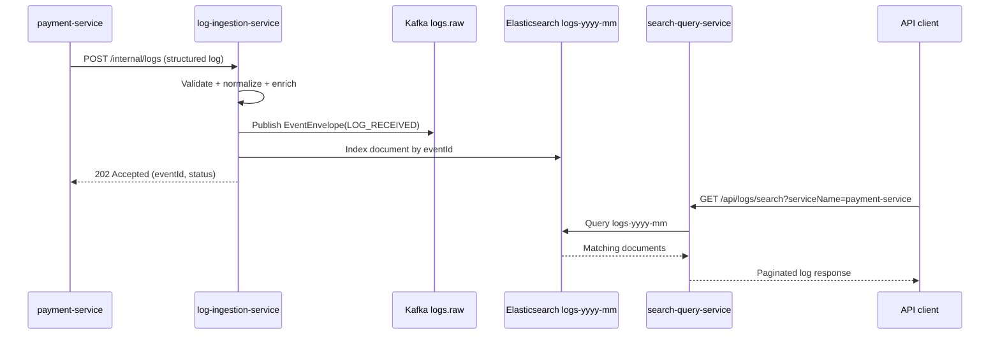

# Sequence: Log Ingestion

This sequence captures a single structured log event moving through ingestion and indexing.

```mermaid
sequenceDiagram
    participant Sample as payment-service
    participant Ingestion as log-ingestion-service
    participant Kafka as Kafka logs.raw
    participant Elastic as Elasticsearch logs-yyyy-mm
    participant Search as search-query-service
    participant Client as API client

    Sample->>Ingestion: POST /internal/logs (structured log)
    Ingestion->>Ingestion: Validate + normalize + enrich
    Ingestion->>Kafka: Publish EventEnvelope(LOG_RECEIVED)
    Ingestion->>Elastic: Index document by eventId
    Ingestion-->>Sample: 202 Accepted (eventId, status)

    Client->>Search: GET /api/logs/search?serviceName=payment-service
    Search->>Elastic: Query logs-yyyy-mm
    Elastic-->>Search: Matching documents
    Search-->>Client: Paginated log response
```
