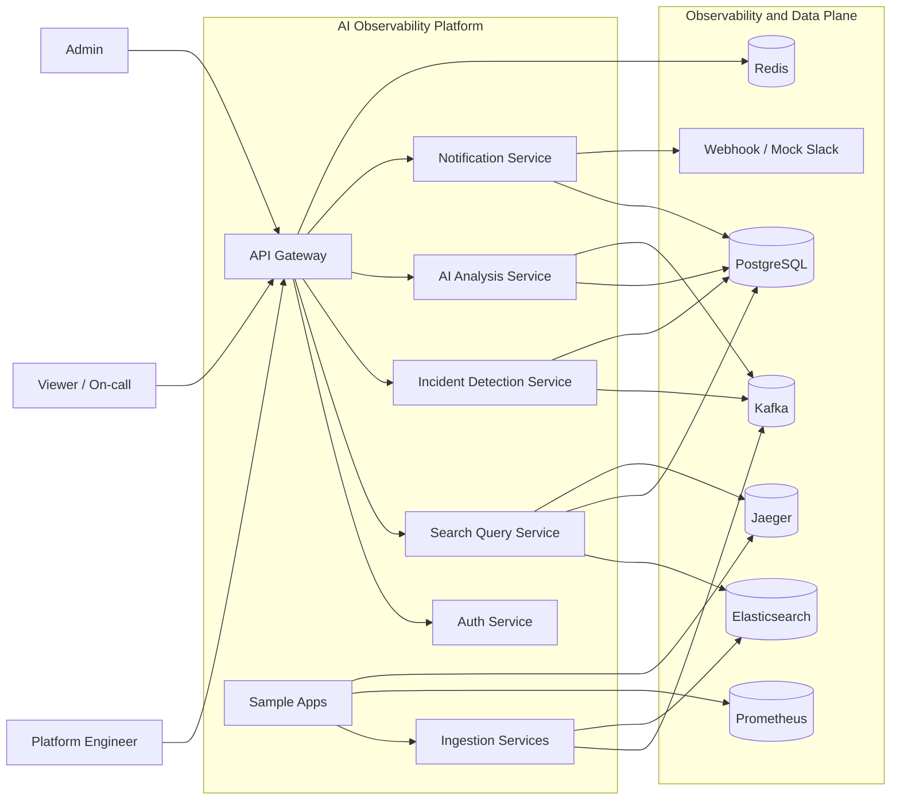

# System Context

This diagram shows the AI Observability Platform in relation to external actors and infrastructure systems.

```mermaid
flowchart LR
    engineer[Platform Engineer]
    viewer[Viewer / On-call]
    admin[Admin]

    subgraph platform[AI Observability Platform]
        gateway[API Gateway]
        auth[Auth Service]
        ingestion[Ingestion Services]
        detection[Incident Detection Service]
        analysis[AI Analysis Service]
        search[Search Query Service]
        notify[Notification Service]
        samples[Sample Apps]
    end

    subgraph observability[Observability and Data Plane]
        kafka[(Kafka)]
        postgres[(PostgreSQL)]
        es[(Elasticsearch)]
        jaeger[(Jaeger)]
        prom[(Prometheus)]
        redis[(Redis)]
        webhooks[Webhook / Mock Slack]
    end

    engineer --> gateway
    viewer --> gateway
    admin --> gateway

    gateway --> auth
    gateway --> search
    gateway --> detection
    gateway --> analysis
    gateway --> notify

    samples --> ingestion
    samples --> prom
    samples --> jaeger

    ingestion --> kafka
    ingestion --> es
    detection --> kafka
    detection --> postgres
    analysis --> postgres
    analysis --> kafka
    search --> es
    search --> postgres
    search --> jaeger
    notify --> postgres
    notify --> webhooks
    gateway --> redis
```
